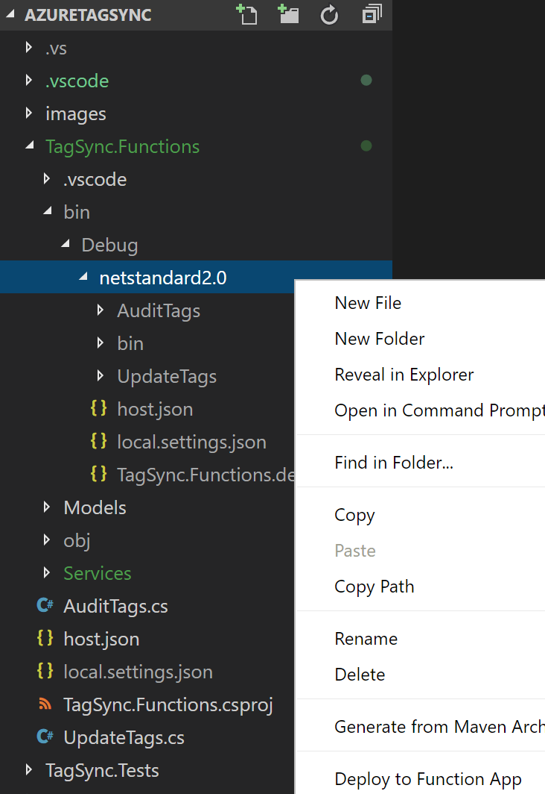
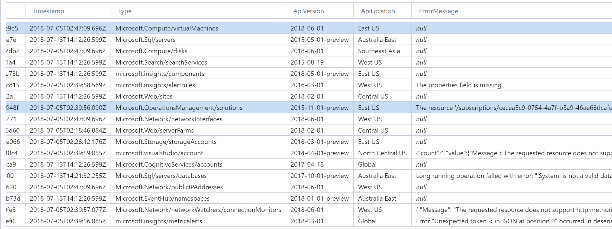

# Automated Tag Synchronization for Azure Resources

TagSync is an application that synchronizes mandatory tags set on Resource Groups to the resources they contain. The application is broken down into two Azure Functions:

- **AuditTags:** Executes on a user-defined schedule and reads in subscription configuration data from the ```AuditConfig``` table. This configuration includes a list of tags that a given resource group in that subscription must implement. The function iterates through each resource group and resource, inspects the tag values, and determines if changes are required (new or modify). If so, a message is added to a queue with the details required to add / modify the tag(s) for that resource. For query efficiency, this function also documents details for each resource type in the ```ResourceTypes``` table. Any resource type listed in this table that has a documented error is skipped.

- **UpdateTags:** Processes each message added to the queue and modifies the tags as necessary. If there are any issues with the tagging, an error is logged in the *ResourceTypes* table.

## Deployment

### Prerequisites

#### Git Tools

Be sure you have git tools installed on your PC or Mac. You can confirm this by running ```git --version``` from a command prompt.

#### .Net Core 2.1

Confirm the .Net Core version installed on your PC or Mac by entering: ```dotnet --version```. It is assumed you have **2.1.300** or higher installed.

#### Azure Functions Core Tools

It is highly recommended the user complete all setup and installation instructions documented here: [Code and test Azure Functions locally](https://docs.microsoft.com/en-us/azure/azure-functions/functions-run-local).

#### Development Tools

It is assumed you are working with an updated version of [Visual Studio Code](https://code.visualstudio.com/) with the [Azure Functions extension](https://marketplace.visualstudio.com/items?itemName=ms-azuretools.vscode-azurefunctions) installed. Visual Studio 2017 also works.

#### Azure Storage Explorer

You must also have a recent version of [Azure Storage Explorer](https://azure.microsoft.com/en-us/features/storage-explorer/) installed.

### Create and configure the Function App

In the Azure Portal, create a new Function App by navigating to App Services and selecting the **Add** button in the upper left. In the Marketplace section, select *Function App*. In the create dialogue, enter the desired name, resource group, and storage account. Be sure to keep Windows as the OS type. It is recommended (but not required) to enable the *Application Insights* option.

Once the Function App is created, a few follow-up configurations are necessary:

#### Upgrade function runtime

In the Azure Portal, navigate to the Function App and select *Function App Settings*. Switch the runtime version to **beta**.

#### Enable Managed Service Identity (MSI)

This application makes use of Managed Service Identity for authenticated access to your subscriptions. This is a great security feature that removes the burden of credential management for services running in Azure. Enable MSI by navigating to **Plafrom features** and selecting **Managed Service Identity (Preview)**. At the next screen, toggle **Register with Azure Active Directory** to **On** and click **Save**.

Next, you must assign the application permissions to each subscription you wish to enable for tag synchronization. This is achieved in the Azure Portal by using the search bar and entering **Subscriptions**. Click the suggested link and select a subscription displayed on the next page. In the settings blade, select **Access Control (IAM)** and click the **Add** button. On the Add Permissions blade at the right, select **Contributor** as the Role and enter the name of your function in the select bar. You should see your function app suggested as shown here:


Select the fucntion app and click **Save**. Repeat this process for any additional subscriptions.

#### Create the configuration tables

Currently, two tables must be manually created within the storage account associated to the Function App before the solution can run. The easiest way to locate the table is by examining the resource group the function was deployed into.

Use Azure Storage Explorer to create tables with the following names:
* ```AuditConfig```
* ```ResourceTypes```

### Deploy the Functions
The quickest way to deploy the functions to your Azure environment is to build the binary from the source code and push a deployment package to the Function App you created earlier. 

> NOTE: A more scalable approach for deploying and maintaining this application in Azure is to use the CI/CD pipeline functionality available in Azure App Service. App Service supports a variety of source control systems such as GitHub and Visual Studio Team Services.

To deploy using Visual Studio Code, follow these steps:

1. Clone the repository to your workstation and open the root folder in VS Code.

2. Right-click TagSync.Functions and select **Open in Terminal** (Mac) or **Open in Command Prompt** (PC)

3. In the terminal window, enter: ```dotnet build```. This will download NuGet dependency packages and generate the C# binary

4. Assuming you have the Azure Functions extension installed in VS Code, you can deploy directly to your Function App by navigating to the following directory: **TagSync.Functions** > **bin** > **debug** > **netstandard 2.0** and right-clicking. In the dialogue menu, select *Deploy to Function App*. You will be prompted to select a valid function app in your subscription. Use the one you created earlier.

    

## Configuration and Operation

By default, the ```AuditTags``` function runs once every 4 hours. The ```UpdateTags``` function is triggered by messages placed into a queue named ```resources-to-tag```. You can manually initialize the process by clicking the Run button on ```AuditTags``` the portal. It is recommended to do this once after the deployment has been completed so that the default columns for the ```AuditConfigTable``` are created.

When in operation, the solution works by interacting with the tables hosted in the Storage Account.

### AuditConfig

For each subscription you wish to audit, you must define a configuration item for it in the AuditConfig table. Configuration currently consists of two columns.

- ```SubscriptionId```: The GUID (ID) that represents the subscription.

- ```RequiredTags```: A comma separated list of tags that must be synchronized from the resource group to the resource item.

Once configuraiton is completed, your table shoud look like the following:


### AuditStats

Information about every subscription audit performed by ```AuditSubscriptionTags``` is recorded in this table.

### ResourceItems

When invoked, ```AuditTags``` reads all items from this table. For query efficiency, details necessary for updating resources, such as a valid API location and version, are stored in this table.

  

Azure does not currently have a unified API for resource tagging. There are cases where exeptions will be thrown when attempting to tag certain resource types. These exceptions are handled by the ```UpdateTags``` function and written to this table.
 
 When ```AuditTags``` is processing a subscription, any resource type with data in the ```ErrorMessage``` field is skipped. That way, repeated API calls that are known to fail are not made. Developers can use the information to update the code to better handle these specific resources.

## Local Development / Debugging

### Service Principal

If you wish to run this function app locally, you must create a [service principal ID](https://docs.microsoft.com/en-us/powershell/azure/create-azure-service-principal-azureps?view=azurermps-6.0.0). Run one of the following commands to create one:

Azure CLI

```
az ad sp create-for-rbac --name ServicePrincipalName
```

PowerShell

```
New-AzureRmADServicePrincipal -DisplayName ServicePrincipalName
```

When completed, add the following entries into the Application Settings of the Function App: ```appId```, ```appSecret```, and ```tenantId```. Populate each entry with the values provided in the the console output.

Finally ensure the Service Principal has permissions to modify objects in your subscription(s).

### local.settings.json

In Azure, connection information that enables the Functions runtime to bind to services like Azure Storage (blobs, tables, and queues) is hosted in Application Settings. When the Functions runtime is running locally, this information is provided by a file named ```local.settings.json```.

This file sensitive information and is excluded from the git repository via the ```.gitignore``` file, so you must download it from the Azure Portal. To do that, execute the following command from the root folder:

```func azure functionapp fetch-app-settings <YourAppName>```

 Once completed, the file should appear with all the settings configured in Application Settings,including the Service Principal information. By default, all values will be encrypted using your computer's machine key. The end result should look something like this:


> NOTE: If you configured MSI for the Function App, you may now delete ```appId```, ```appSecret```, and ```tenantId``` from Application Settings in the Azure Portal. The Service Principal is only intended to be used for local debugging and testing.

Assuming you have the [Functions 2.0 runtime installed and configured from your workstation](https://docs.microsoft.com/en-us/azure/azure-functions/functions-run-local#v2), you should now be able to run and debug this application locally.

## FAQ

### How do I debug a timer trigger function locally?

If you're using Visual Studio Code, navigate to the Debug section and click the green arrow to start the functions runtime and attach the debugger. Next, invoke the timer job by sending an HTTP POST to the following URL:

```html
http://localhost:7071/admin/functions/AuditResourceGroups
```

This will invoke the function and allow you to use the debugger.